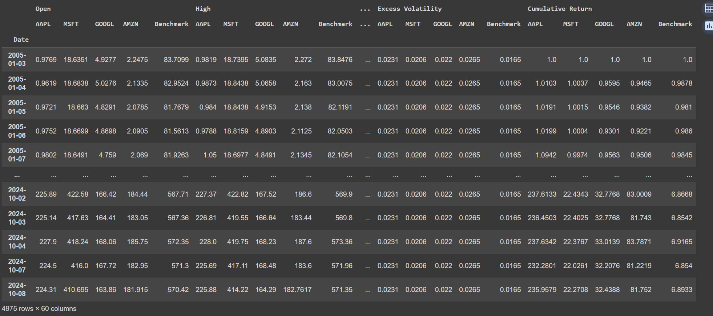
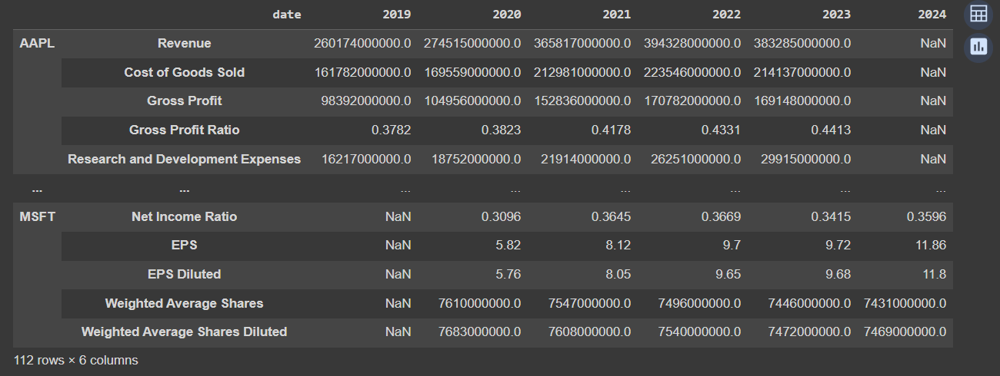
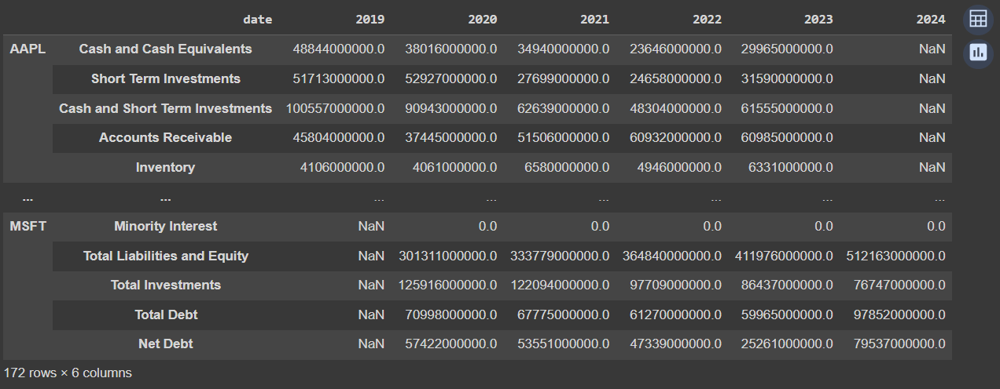
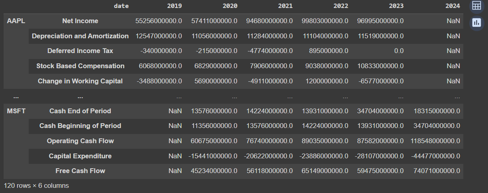

import OutputDisplay from '../../components/OutputDisplay.astro'
import ToolkitButton from '../../components/ToolkitButton.astro'
import TwoColumnList from '../../components/TwoColumnList.astro'
import 'katex/dist/katex.min.css'
import PlotlyLineChart from '../../components/PlotlyLineChart.astro'
import PlotlyStackedBar from '../../components/PlotlyStackedBar.astro'
import PlotlyCashFlowsChart from '../../components/PlotlyCashFlowsChart.astro'
import PlotlyIncomeStatementChart from '../../components/PlotlyIncomeStatementChart.astro'
import LoadPlotly from '../../components/LoadPlotly.jsx'

In today's data-driven business world, having the ability to analyze and interpret financial data is a core competency many organizations must have to sustain their competitive advantage. Python, with its rich ecosystem of packages, has become a go-to language for financial analysis.

This guide introduces some of the fundamentals of Python and finance using the powerful [Finance Toolkit](https://www.jeroenbouma.com/projects/financetoolkit/docs) package, developed by [Jeoren Bouma](https://www.jeroenbouma.com/), a seasoned quantitative investment strategist and Python programmer from the Netherlands.

We’ll explore how to set up the toolkit, retrieve different types of financial data, and prepare this data for further analysis. While the Finance Toolkit offers a wide range of advanced features, this guide will concentrate on its core data gathering capabilities, providing you with a solid foundation for financial data retrieval and preparation.

## 2. What is Finance Toolkit?

Finance Toolkit is an open-source Python package designed to simplify and streamline financial analysis tasks. It provides a comprehensive set of tools for accurately gathering financial data, calculating key metrics, and performing various types of financial analyses.

Finance Toolkit is complemented by [Finance Database](https://github.com/JerBouma/FinanceDatabase), which boasts over 300,000 symbols, including Equities, ETFs, Funds, Indices, Currencies, Cryptocurrencies, and Money Markets. By leveraging both tools, a robust competitive analysis can be performed, seamlessly integrating the tickers from the Finance Database into the Finance Toolkit.

**Note:** this guide focuses on features available with a _FREE_ [Financial Modeling Prep (FMP)](https://site.financialmodelingprep.com/) account, which allows up to 250 API calls per day. Some advanced functionalities require a Premium FMP membership and are omitted from this guide.

### 2.1. Finance Toolkit Modules

Finance Toolkit includes several specialized modules, each focusing on different aspects of financial analysis. Hover over each button to learn more about the module:

<ToolkitButton
	modules={[
		{
			name: 'Toolkit',
			description:
				'Core module with functions for collecting and parsing financial data, including historical data, fundamental data, enterprise values, and company profiles.'
		},
		{
			name: 'Discovery',
			description:
				'Lists of companies, cryptocurrencies, forex, commodities, ETFs, and indices, with screeners, quotes, and performance metrics.'
		},
		{
			name: 'Ratios',
			description:
				'Over 50+ financial ratios in 5 categories: efficiency, liquidity, profitability, solvency, and valuation.'
		},
		{
			name: 'Models',
			description:
				'Executes well-known financial models such as DUPONT and Discounted Cash Flow (DCF).'
		},
		{
			name: 'Options',
			description:
				'Calculates options metrics including Greeks, Black Scholes Model, Option Chains, and Implied Volatilities.'
		},
		{
			name: 'Technicals',
			description:
				'30+ Technical Indicators in 4 categories: breadth, momentum, overlap, and volatility.'
		},
		{
			name: 'Fixed Income',
			description:
				'Calculations for Effective Yield, Durations, Yield to Maturity, and models for derivative instruments.'
		},
		{
			name: 'Risk',
			description:
				'Computes risk metrics like VaR, cVaR, Maximum Drawdown, Correlations, GARCH, and EWMA.'
		},
		{
			name: 'Performance',
			description:
				"Calculates performance metrics such as Sharpe Ratio, Sortino Ratio, Jensen's Alpha, and CAPM."
		},
		{
			name: 'Economics',
			description:
				'Provides economic indicators for 60+ countries, including CPI, GDP, Unemployment Rates, and Government Interest Rates.'
		}
	]}
/>

There are numerous functions available in each module, which are detailed in the [documentation](https://www.jeroenbouma.com/projects/financetoolkit/docs). However, this guide only provides just a glimpse, showcasing a few functions such as `get_historical_data`, `get_income_statement`, `get_balance_sheet_statement`, & `get_cash_flow_statement`.

### 2.3. Key Python and Finance Concepts

Before diving into the practical aspects of using the Finance Toolkit, let's outline the key Python and finance concepts that underpin our data gathering process:

<TwoColumnList
	leftTitle='Python Concepts'
	rightTitle='Finance Concepts'
	leftItems={[
		'Package Import: Understanding how to import and use the Finance Toolkit package.',
		'Object-Oriented Programming: Working with the Toolkit class to interact with financial data.',
		'API Integration: Using API keys to authenticate and access financial data sources.',
		'Data Structures: Handling complex data structures like multi-index DataFrames.',
		'Method Chaining: Utilizing toolkit methods in sequence for efficient data retrieval and processing.',
		'Error Handling: Managing potential issues in data retrieval and processing.'
	]}
	rightItems={[
		'OHLC Data: Understanding Open, High, Low, Close price data for securities.',
		'Financial Statements: Grasping the key components of Income Statements, Balance Sheets, and Cash Flow Statements.',
		'Time Series Analysis: Working with financial data across different time periods.',
		'Market Benchmarks: Understanding the role of benchmark comparisons in financial analysis.',
		'Fundamental vs Technical Data: Distinguishing between company financial data and market price data.',
		'Financial Ratios: Introduction to key financial metrics derived from raw financial data.'
	]}
/>

By understanding these Python and finance concepts, you'll be better equipped to efficiently gather and interpret financial data using the Finance Toolkit. This foundation will allow you to move beyond mere data collection to meaningful financial analysis and modeling.

## 3. Gathering Financial Data

In financial analysis, gathering accurate and relevant data is the first step. The Finance Toolkit simplifies this process by providing functions to collect and parse various types of financial data. Let's explore how to retrieve and interpret this data.

### 3.1. Install and Setup

The required dependencies must be installed before the toolkit class can be implemented.

```python
# Install the financetoolkit package using `pip`
pip install financetoolkit -U

# Import modules
from financetoolkit import Toolkit

# Set up API access to FMP
API_KEY = "FINANCIAL_MODELING_PREP_API_KEY"
```

**Key Takeaway:** Understanding how to set up your development environment is important for any Python project, especially when working with financial data that requires API access.

### 3.2. Initiate Toolkit

The Toolkit class must be initialized to analyze financial data.

```python
# Initialize the Toolkit with company tickers, API key, start date, and benchmark ticker
companies = Toolkit(
    ["AAPL", "MSFT", "GOOGL", "AMZN"],
    api_key=API_KEY,
    start_date="2005-01-01",
    benchmark_ticker="SPY"
)
```

**Key Takeaway:** Learning to initialize objects with specific parameters allows you to customize your financial analysis for different companies and time periods. **Note:** additional parameters can be found in the [documentation](https://www.jeroenbouma.com/projects/financetoolkit/docs).

### 3.3 Get Financial Data

To conduct a comprehensive financial analysis, we need various types of data, including historical stock prices and financial statements. The Finance Toolkit allows us to retrieve this data efficiently.

#### 3.3.1. Historical Stock Price Data

Historical stock price data is fundamental for analyzing a company's market performance over time. Using the Finance Toolkit, we can easily retrieve this data:

```python
# Daily historical data
companies.get_historical_data()
```



This function returns a DataFrame containing daily historical price data for our selected companies (AAPL, MSFT, GOOGL, AMZN) and the benchmark (SPY) from 2005 to 2024. It includes Open, High, Low, Close prices, Volume, and calculated metrics like Cumulative Return and Volatility.

The power of this data lies in its ability to show trends over time. For instance, we can visualize cumulative returns to compare the performance of different companies:

<PlotlyLineChart />

This chart shows total investment returns for Apple, Microsoft, Google, and Amazon from 2006 to 2024. Apple leads dramatically, especially post-2019, reaching nearly 250% return. Amazon follows with high but volatile growth. Google and Microsoft show steady but slower growth. This metric is crucial as it reflects total value creation, including capital gains and reinvested dividends. It demonstrates each company's success in their markets - Apple's expansion into smartphones and services, Amazon's e-commerce dominance, Google's ad revenue consistency, and Microsoft's cloud pivot. For investors, it clearly illustrates long-term wealth generation potential in the tech sector.

#### 3.3.2. Income Statement

The Income Statement shows a company's revenues and expenses over a specific period:

```python
companies.get_income_statement()
```



This statement tells the story of a company's profitability. It's important to remember that while revenues are generally straightforward, many expenses involve management decisions and accounting rules. Analyzing trends in revenues, expenses, and profit margins can reveal a lot about a company's operational efficiency and competitive position.

<PlotlyIncomeStatementChart />

`Net income` is a crucial measure of a company's profitability. Apple consistently leads, reflecting its high-margin products and efficient operations. Microsoft shows strong growth, likely due to its cloud services and software dominance. Google maintains steady profits from its advertising business. Amazon's fluctuating net income may reflect its strategy of reinvesting heavily in growth. This metric is vital as it directly impacts shareholder value and a company's ability to fund future innovations.

#### 3.3.3. Balance Sheet

The Balance Sheet provides a snapshot of a company's financial position at a specific point in time:

```python
companies.get_balance_sheet_statement()
```



This statement is based on the accounting equation: `Assets = Liabilities + Shareholders' Equity`. It's crucial to understand that many values on the Balance Sheet are based on estimates and assumptions. Analyzing the Balance Sheet can provide insights into a company's liquidity, solvency, and overall financial flexibility.

<PlotlyStackedBar />

`Shareholders equity` represents the total value of a company owned by its shareholders. Microsoft and Google show significant growth in shareholder equity, indicating strong retained earnings and possibly successful equity offerings. Apple's relatively stable equity suggests consistent returns to shareholders through dividends and buybacks. Amazon's growing equity reflects its strategy of reinvesting profits. High shareholder equity can provide a buffer during economic downturns and fuel future growth, making it a key indicator of long-term financial health.

#### 3.3.4. Cash Flow Statement

The Cash Flow Statement shows how changes in balance sheet accounts and income affect cash and cash equivalents:

```python
companies.get_cash_flow_statement()
```



This statement is often considered the most important, as it reconciles the profitability reported on the Income Statement with the actual cash generated by the business. It's divided into operating, investing, and financing activities, providing a comprehensive view of how a company generates and uses its cash.

Once we've retrieved the financial statements, we can analyze specific data points. For example, let's examine the Total Shareholder Equity for our companies over time:

```python
# Save to a variable for easier access
balance_sheet = companies.get_balance_sheet_statement()

# Plot the value of Total Shareholder Equity for each company in 2022
shareholder_value = balance_sheet.loc[
    (companies._tickers, "Total Shareholder Equity"), :"2022"
].T
shareholder_value.columns = companies._tickers
shareholder_value.plot.bar(
    figsize=(15, 3),
    title="Total Shareholder Equity over the Years",
    grid=True,
    colormap="inferno",
    rot=0,
    xlabel="Date",
    ylabel="Total Shareholder Equity",
    stacked=True,
)
```

<PlotlyCashFlowsChart />

`Free cash flow` shows a company's ability to generate cash after accounting for capital expenditures. Apple leads in this metric, demonstrating its efficiency in converting revenue to cash. Microsoft and Google also show strong and growing free cash flow, indicating robust operational efficiency. Amazon's lower free cash flow might reflect its heavy investments in infrastructure and new technologies. This metric is crucial as it represents the cash a company can use for acquisitions, debt repayment, dividends, or reinvestment, directly impacting its ability to create future value for shareholders.

These stacked bar charts show the total shareholder equity for each company from 2019 to 2022. Such a visualization can reveal trends in company growth and financial strength over time.

### 4. Key Takeaways

1. The Finance Toolkit simplifies the process of retrieving complex financial data, allowing analysts to focus on interpretation and decision-making.
2. Historical stock data can reveal long-term trends and comparative performance between companies and against market benchmarks.
3. Financial statements each tell a different part of a company's financial story. The Income Statement shows profitability, the Balance Sheet shows financial position, and the Cash Flow Statement shows cash generation and usage.
4. It's crucial to remember that while financial statements contain many hard numbers, they also involve estimates, assumptions, and management decisions.
5. Visualizing financial data can reveal trends and comparisons that might not be immediately apparent from the raw numbers.

By mastering these tools and concepts, you'll be better equipped to retrieve, analyze, and interpret financial data, leading to more informed business decisions. Remember, the key to financial intelligence is not just in accessing the numbers, but in understanding the story they tell about a company's financial health and performance.

## 5. Conclusion

This guide has equipped you with the fundamentals of financial data analysis using the Finance Toolkit. You've learned to retrieve and visualize stock prices, financial statements, and key metrics for major tech companies. However, this is just the beginning of what the toolkit offers:

- The Ratios Module provides over 50 pre-calculated ratios across efficiency, liquidity, profitability, solvency, and valuation categories.
- The Models Module executes complex analyses like DUPONT and Discounted Cash Flow (DCF).
- The Options Module calculates Greeks, Black-Scholes Model, Option Chains, and Implied Volatilities.
- The Technicals Module offers 30+ indicators in breadth, momentum, overlap, and volatility categories.
- The Fixed Income Module handles calculations like Effective Yield, Duration, and derivative instrument valuation.
- The Risk Module computes metrics such as VaR, cVaR, Maximum Drawdown, and GARCH.
- The Performance Module calculates key measures like Sharpe Ratio, Jensen's Alpha, and CAPM.
- The Economics Module provides insights on key economic indicators for over 60 countries.

While the Finance Toolkit's pre-calculated metrics save time, it's important to understand the underlying principles. As you progress, consider delving into the calculations behind these metrics to deepen your financial analysis skills.

## 6. Next Steps

1. Apply these techniques to analyze companies you're interested in.
2. Explore other modules of the Finance Toolkit to enhance your analysis.
3. Follow my upcoming series for advanced financial analysis techniques.
4. Join our community to share insights and learn from fellow financial analysts.

By mastering the Finance Toolkit, you're well on your way to becoming a proficient financial analyst. Remember, the true power lies not just in accessing data, but in deriving meaningful insights that drive informed financial decisions.
